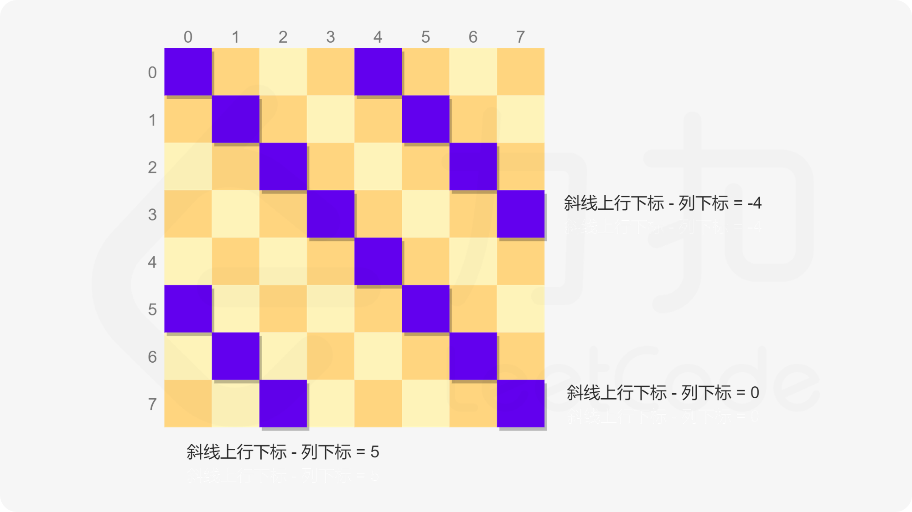
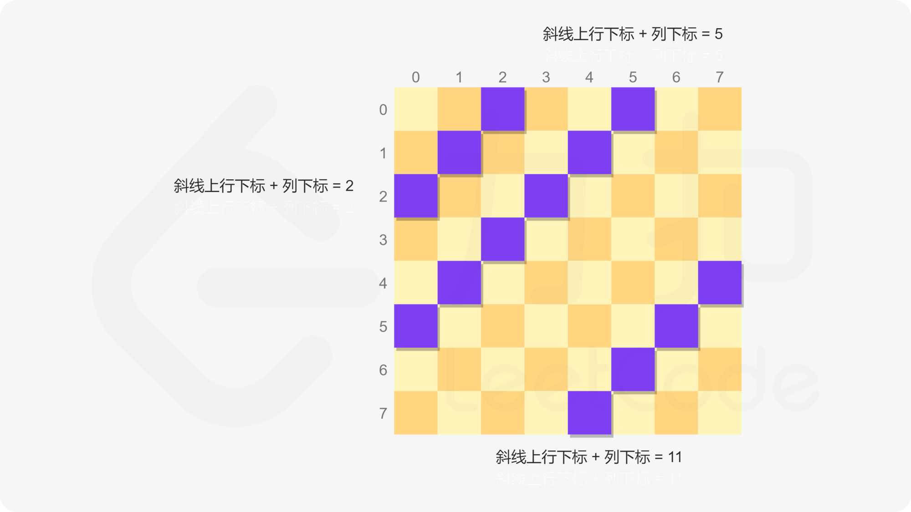

# N 皇后

> 难度：困难
>
> https://leetcode-cn.com/problems/n-queens/

## 题目

`n 皇后问题` 研究的是如何将 `n` 个皇后放置在 `n×n` 的棋盘上，并且使皇后彼此之间不能相互攻击。

给你一个整数 `n` ，返回所有不同的 `n` 皇后问题 的解决方案。

每一种解法包含一个不同的 `n` 皇后问题 的棋子放置方案，该方案中 `Q` 和 `.` 分别代表了皇后和空位。

### 示例

#### 示例 1


```
输入：n = 4
输出：[[".Q..","...Q","Q...","..Q."],["..Q.","Q...","...Q",".Q.."]]
解释：如上图所示，4 皇后问题存在两个不同的解法。
```

#### 示例 2

```
输入：n = 1
输出：[["Q"]]
```

## 解法

### 基于集合的回溯

为了判断一个位置所在的列和两条斜线上是否已经有皇后，使用三个集合`columns`、`diagonals1`、`diagonals2`分别记录每一列以及
两个方向的每条斜线上是否有皇后。

列的表示法很直观，一共有 `N` 列，每一列的下标范围从 `0` 到 `N-1`，使用列的下标即可明确表示每一列。

对于每个方向的斜线，需要找到斜线上的每个位置的行下标与列下标之间的关系。

方向一的斜线为从左上到右下方向，同一条斜线上的每个位置满足行下标与列下标之差相等，例如 `(0,0)` 和 `(3,3)` 在同一条方向一
的斜线上。因此使用行下标与列下标之差即可明确表示每一条方向一的斜线。



方向二的斜线为从右上到左下方向，同一条斜线上的每个位置满足行下标与列下标之和相等，例如 `(3,0)` 和 `(1,2)` 在同一条方向二
的斜线上。因此使用行下标与列下标之和即可明确表示每一条方向二的斜线。



每次放置皇后时，对于每个位置判断其是否在三个集合中，如果三个集合都不包含当前位置，则当前位置是可以放置皇后的位置。

```typescript
/**
 * 基于集合的回溯
 * @desc 时间复杂度 O(N!)   空间复杂度 O(N)
 * @param n {number}
 * @return {string[][]}
 */
export function solveNQueens(n: number): string[][] {
  const solutions: string[][] = [];
  const queens = new Array<number>(n).fill(-1);
  const columns = new Set<number>(); // 列
  const diagonals1 = new Set<number>(); // 从左上到右下方向
  const diagonals2 = new Set<number>(); // 从右上到左下方向
  backtrack(0);
  return solutions;

  function backtrack(row: number) {
    if (row === n) {
      const board = generateBoard(queens);
      solutions.push(board);
      return;
    }

    for (let i = 0; i < n; i++) {
      // 如果同列上已经有皇后，就跳过
      if (columns.has(i)) continue;

      // 如果同对角线上已经有皇后，就跳过
      let diagonal1 = row - i;
      if (diagonals1.has(diagonal1)) continue;
      let diagonal2 = row + i;
      if (diagonals2.has(diagonal2)) continue;

      queens[row] = i;
      columns.add(i);
      diagonals1.add(diagonal1);
      diagonals2.add(diagonal2);
      backtrack(row + 1);
      queens[row] = -1;
      columns.delete(i);
      diagonals1.delete(diagonal1);
      diagonals2.delete(diagonal2);
    }
  }

  function generateBoard(queens: number[]): string[] {
    const board: string[] = [];

    for (let i = 0; i < n; i++) {
      const row = new Array<string>(n).fill('.');
      row[queens[i]] = 'Q';
      board.push(row.join(''));
    }

    return board;
  }
}
```
