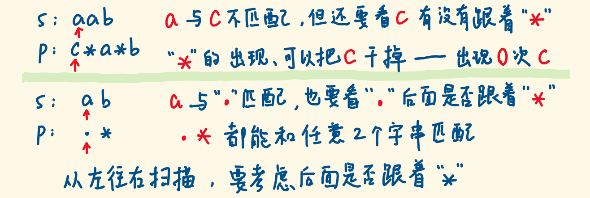

#  正则表达式匹配
## 题目
给你一个字符串`s`和一个字符规律`p`，请你来实现一个支持 `'.'` 和 `'*'` 的正则表达式匹配。

- `'.'` 匹配任意单个字符
- `'*'` 匹配零个或多个前面的那一个元素

所谓匹配，是要涵盖**整个**字符串`s`的，而不是部分字符串。

### 示例
#### 示例 1：

```
输入：s = "aa" p = "a"
输出：false
解释："a" 无法匹配 "aa" 整个字符串。
```
#### 示例 2:

```
输入：s = "aa" p = "a*"
输出：true
解释：因为 '*' 代表可以匹配零个或多个前面的那一个元素, 在这里前面的元素就是 'a'。因此，字符串 "aa" 可被视为 'a' 重复了一次。
```
#### 示例 3：

```
输入：s = "ab" p = ".*"
输出：true
解释：".*" 表示可匹配零个或多个（'*'）任意字符（'.'）。
```
#### 示例 4：

```
输入：s = "aab" p = "c*a*b"
输出：true
解释：因为 '*' 表示零个或多个，这里 'c' 为 0 个, 'a' 被重复一次。因此可以匹配字符串 "aab"。
```
#### 示例 5：

```
输入：s = "mississippi" p = "mis*is*p*."
输出：false
```

## 解法

### 解题思路
#### 从左往右扫的话
字符后面是否跟着星号会影响结果，分析起来有点复杂。



#### 选择从右往左扫描
星号的前面肯定有一个字符，星号也只影响这一个字符，它就像一个拷贝器。


`s`、`p` 串是否匹配，取决于：最右端是否匹配、剩余的子串是否匹配。

只是最右端可能是特殊符号，需要分情况讨论而已。

#### 通用地表示出子问题

大子串是否匹配，和剩余子串是否匹配，是规模不一样的同一问题。


##### **情况1：`s[i-1]` 和 `p[j-1]` `是匹配的**

最右端的字符是匹配的，那么，大问题的答案 = 剩余子串是否匹配。


##### **情况2：`s[i-1]` 和 `p[j-1]` `是不匹配的**

右端不匹配，还不能判死刑——可能是 `p[j-1]` 为星号造成的不匹配，星号不是真实字符，它不匹配不算数。

如果 `p[j-1]p[j−1]` 不是星号，那就真的不匹配了。


**`p[j-1]` 是星号，并且 `s[i-1]` 和 `p[j-2]` 匹配，要考虑三种情况：**

- `p[j−1]` 星号可以让 `p[j-2]` 在 p 串中消失、出现 1 次、出现 >=2 次。
- 只要其中一种使得剩余子串能匹配，那就能匹配，见下图 a1、a2、a3。


- a3 情况：假设 s 的右端是一个 `a`，p 的右端是 `a*` ，`*` 让 `a` 重复 >= 2 次
  - 星号不是真实字符，s、p是否匹配，要看 s 去掉末尾的 `a`，p 去掉末尾一个 `a`，剩下的是否匹配。
  - 星号拷贝了 >=2 个 `a`，拿掉一个，剩下 >=1 个`a`，p 末端依旧是 `a*` 没变。
  - s 末尾的 `a` 被抵消了，继续考察 `s(0,i-2)` 和 `p(0,i-1)` 是否匹配。


**`p[j−1]` == "∗"，但 `s[i-1]` 和 `p[j−2]` 不匹配**
`s[i−1]` 和 `p[j−2]` 不匹配，还有救，`p[j−1]` 星号可以干掉 `p[j−2]`，继续考察 `s(0,i-1)` 和 `p(0,j-3)`。


#### base case
p为空串，s不为空串，肯定不匹配。

s为空串，但p不为空串，要想匹配，只可能是右端是星号，它干掉一个字符后，把 p 变为空串。

s、p都为空串，肯定匹配。


###
