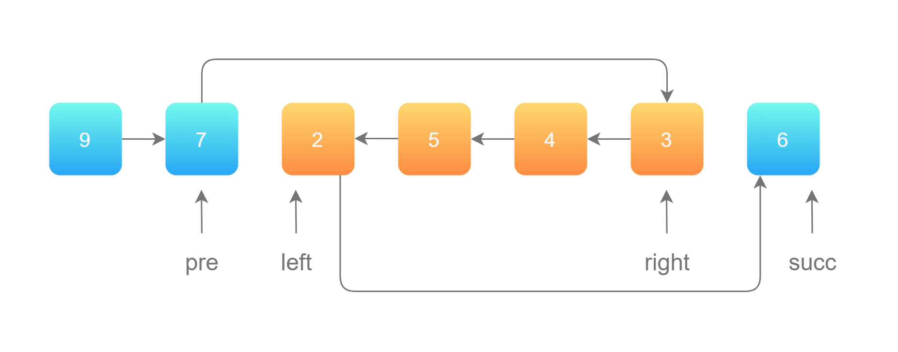
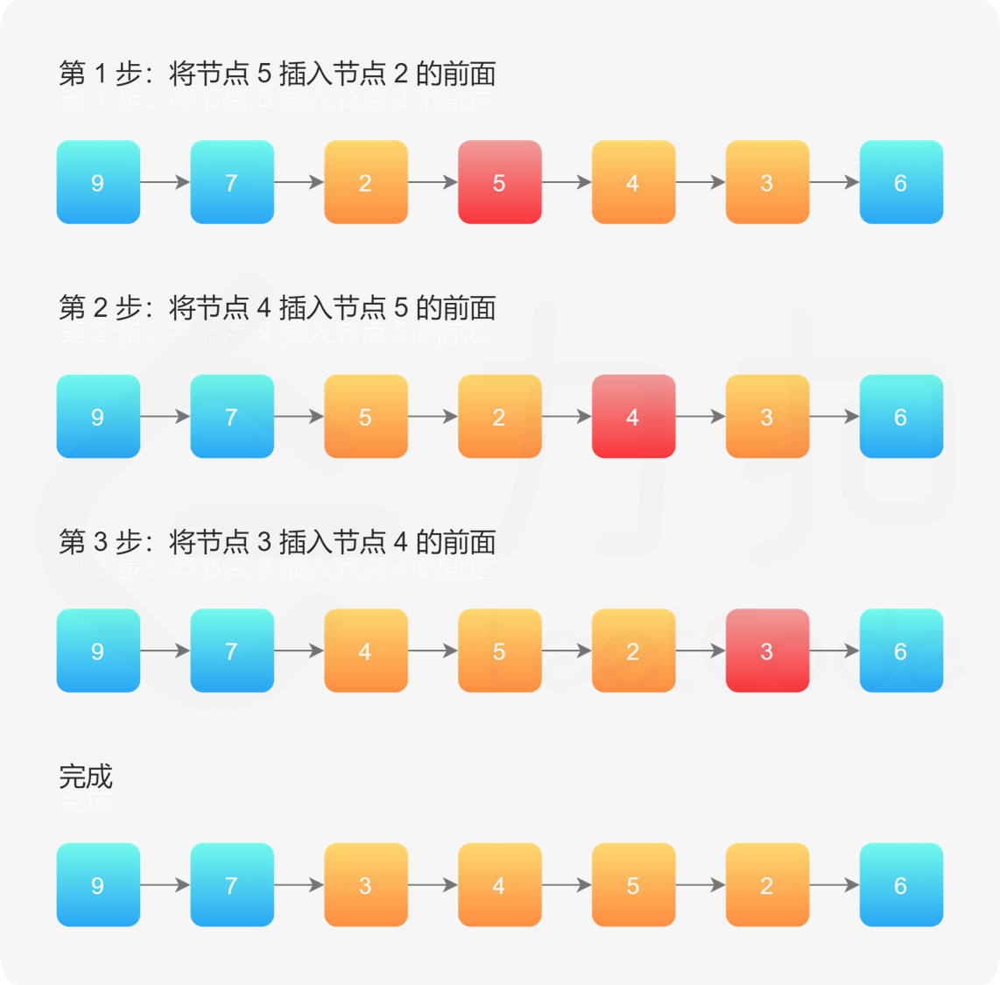

# 反转链表 II

> 难度：中等
>
> https://leetcode-cn.com/problems/reverse-linked-list-ii/

## 题目

给你单链表的头指针 `head` 和两个整数 `left` 和 `right` ，其中 `left <= right` 。请你反转从位置 `left` 到位置 `right` 的链表节点，返回 **反转后的链表** 。

### 示例

#### 示例 1：


```
输入：head = [1,2,3,4,5], left = 2, right = 4
输出：[1,4,3,2,5]
```

#### 示例 2：

```
输入：head = [5], left = 1, right = 1
输出：[5]
```

## 解题

### 穿针引线

先提出`left`到`right`的链表，然后进行反转，最后再拼接起来。



```typescript
/**
 * 穿针引线
 * @desc 时间复杂度 O(N)  空间复杂度 O(1)
 * @param head {ListNode | null}
 * @param left {number}
 * @param right {number}
 * @return {ListNode | null}
 */
export function reverseBetween(
  head: ListNode | null,
  left: number,
  right: number
): ListNode | null {
  const dummyNode = new ListNode(0, head);

  // pre定位到left前一个的节点
  let pre = dummyNode;
  for (let i = 0; i < left - 1; i++) {
    pre = pre.next!;
  }

  // rightNode定位到right的节点
  let rightNode = pre;
  for (let i = 0; i < right - left + 1; i++) {
    rightNode = rightNode.next!;
  }

  // leftNode定位到left的节点
  const leftNode = pre.next!;
  // cur定位到right的下一个节点
  const cur = rightNode.next;

  // 切断节点
  pre.next = null;
  rightNode.next = null;

  // 反转链表
  reverseLinkedList(leftNode);

  pre.next = rightNode;
  leftNode.next = cur;
  return dummyNode.next;

  /**
   * 反转链表
   * @param head
   */
  function reverseLinkedList(head: ListNode) {
    let pre = null;
    let cur = head;

    while (cur) {
      const next = cur.next;
      cur.next = pre;
      pre = cur;
      cur = next!;
    }
  }
}
```

### 穿针引线(头插法)

在需要反转的区间里，每遍历到一个节点，让这个新节点来到反转部分的起始位置。



调整位置的操作步骤：

- 先将`cur`的下一个节点记录为`next`；
- 把`cur`的下一个节点指向`next`的下一个节点；
- 把`next`的下一个节点指向`pre`的下一个节点；
- 把`pre`的下一个节点指向`next`


```typescript
/**
 * 穿针引线(头插法)
 * @desc 时间复杂度 O(N)  空间复杂度 O(1)
 * @param head {ListNode | null}
 * @param left {number}
 * @param right {number}
 * @return {ListNode | null}
 */
export function reverseBetween2(
  head: ListNode | null,
  left: number,
  right: number
): ListNode | null {
  const dummyNode = new ListNode(0, head);
  let pre = dummyNode;

  // 移动到left的上一个节点
  for (let i = 0; i < left - 1; i++) {
    pre = pre.next!;
  }

  const cur = pre.next!;
  // 遍历left到right区间的节点
  for (let i = 0; i < right - left; i++) {
    const next = cur.next!;
    cur.next = next.next;
    next.next = pre.next;
    pre.next = next;
  }

  return dummyNode.next;
}
```

